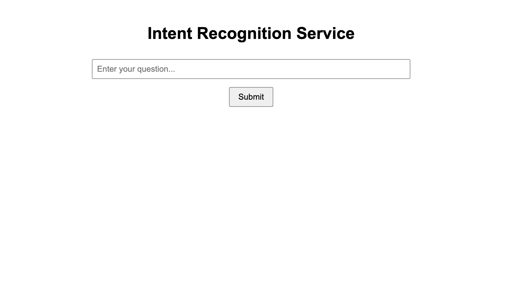
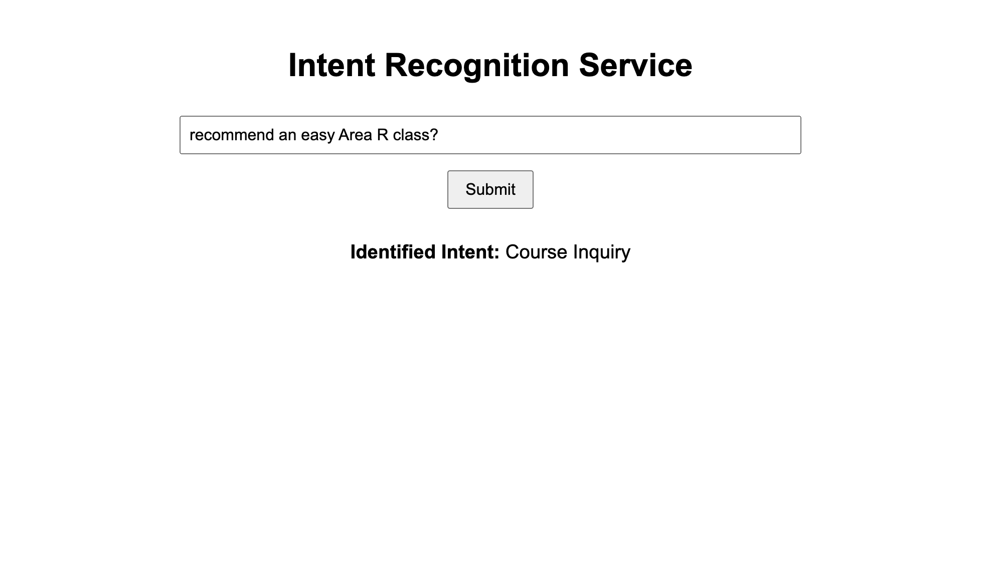
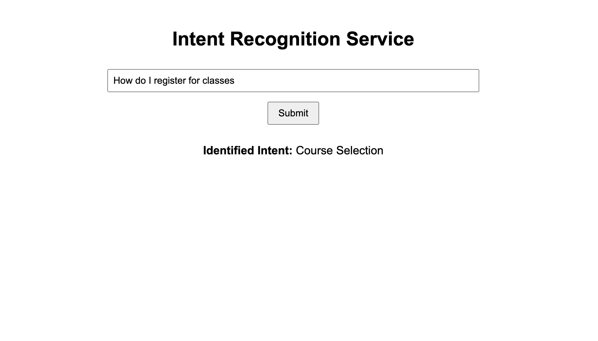

# **Intent Recognition App**

This project is a **React-based web application** that uses **TensorFlow.js** and the **Universal Sentence Encoder** to perform **intent recognition**. Users can input natural language questions, and the app identifies the closest matching intent based on pre-trained embeddings.




## **Features**

- **Client-Side Intent Recognition**: The model runs entirely in the browser, ensuring fast and private intent recognition.
- **Universal Sentence Encoder**: The app uses TensorFlow.js with Universal Sentence Encoder to generate sentence embeddings for intent matching.
- **Interactive UI**: Users can input questions and get real-time intent recognition results.

---

## **Table of Contents**

- [Installation](#installation)
- [Usage](#usage)
- [Deployment](#deployment)
- [Technical Details](#technical-details)

---

## **Installation**

### **Prerequisites**

- **Node.js** (v14 or above)
- **npm** or **yarn** package manager

### **Step-by-Step Installation**

1. **Clone the repository**:

   ```bash
   git clone https://github.com/feliks-j/intent-recognition.git
   ```

2. **Navigate to the project directory**:

   ```bash
   cd intent-recognition
   ```

3. **Install the dependencies**:

   ```bash
   npm install
   ```

4. **Run the application**:
   ```bash
   npm start
   ```

   The app will be available at `http://localhost:3000`.

---

## **Usage**

Once the app is running, follow these steps to use it:

1. **Enter a question** in the input field on the main page.
2. **Click the "Submit" button** to send the question for intent recognition.
3. The **matched intent** will be displayed below the input field based on the pre-trained model.

---

## **Deployment**

### **Deploying to Vercel**

To deploy this app on Vercel, follow these steps:

1. **Install the Vercel CLI**:

   ```bash
   npm install -g vercel
   ```

2. **Login to Vercel**:

   ```bash
   vercel login
   ```

3. **Deploy the app**:

   In the project directory, run:

   ```bash
   vercel
   ```

   Vercel will guide you through the deployment process, and once the deployment is successful, you will get a URL where the app is hosted (e.g., `https://your-app-name.vercel.app`).

4. **Access the deployed app**: Once deployed, the app will be live at the provided URL.

---

## **Technical Details**

### **Tech Stack**

- **React**: The frontend is built using React.
- **TensorFlow.js**: TensorFlow.js is used to load and run the Universal Sentence Encoder directly in the browser.
- **Universal Sentence Encoder**: This is a pre-trained model that generates embeddings for sentences, which are used for intent recognition.
- **Vercel**: For deployment of the web application.

### **How It Works**

1. **Sentence Embeddings**: When the app starts, the Universal Sentence Encoder model is loaded in the browser.
2. **Input Question**: When the user inputs a question, the app generates an embedding (vector representation) of the question.
3. **Similarity Calculation**: The app compares the input question's embedding with the embeddings of predefined example sentences using cosine similarity.
4. **Intent Recognition**: The predefined example sentence with the highest similarity score is identified, and its corresponding intent is displayed as the result.

### **Dependencies**

- **@tensorflow/tfjs**: TensorFlow.js for machine learning in the browser.
- **@tensorflow-models/universal-sentence-encoder**: A pre-trained model for generating sentence embeddings.
- **React**: The user interface is built using React.
- **Axios**: If using a backend to fetch data (optional).
